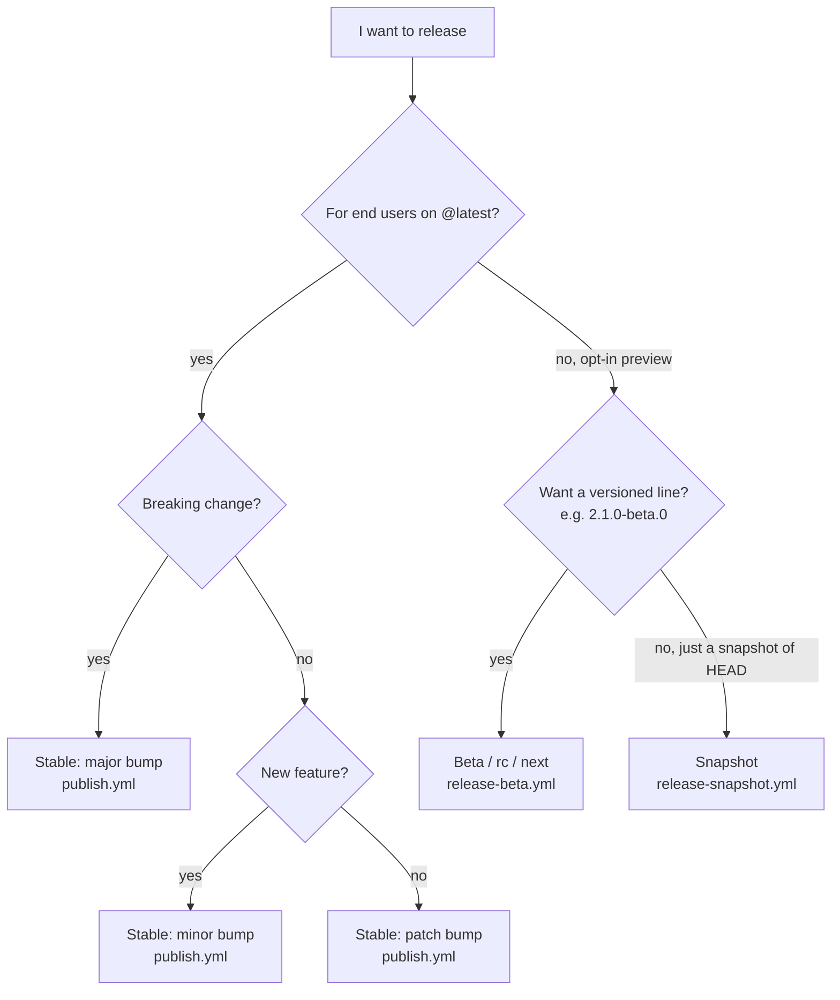
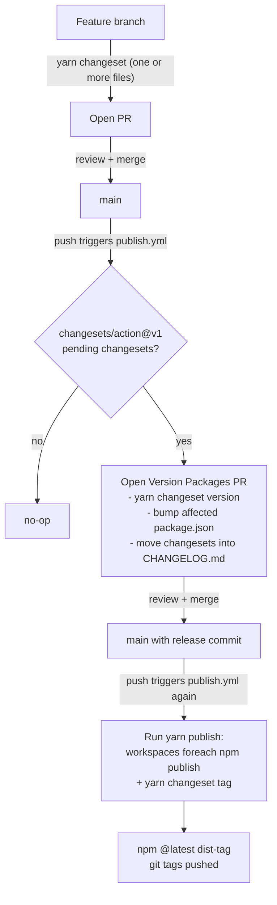
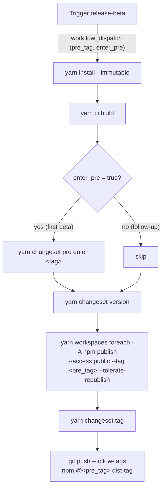
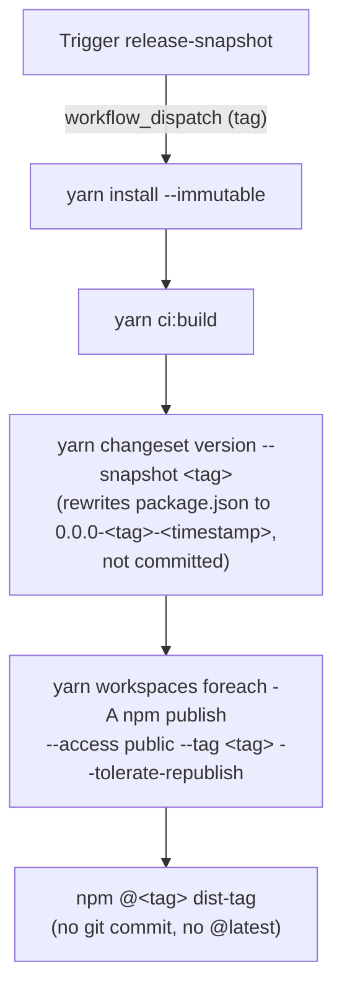

# Publishing `@dhruv-m-patel/*` packages

Single canonical reference for releasing packages from this monorepo.

Versioning is **independent per package** and **driven by Changesets**. Each package's version in `packages/<name>/package.json` is the source of truth; the CI workflows drive every npm publish.

## Quick reference

| Want to release                               | Do this                                                                                         | Workflow                                       | Bumps version                   | npm dist-tag                        |
| --------------------------------------------- | ----------------------------------------------------------------------------------------------- | ---------------------------------------------- | ------------------------------- | ----------------------------------- |
| Stable patch / minor / major                  | `yarn changeset` -> commit -> merge to `main`                                                   | `publish.yml` (auto on push)                   | yes (via release PR)            | `latest`                            |
| Beta / rc / next prerelease                   | Run `release-beta` workflow with `enter_pre=true` (first time per line) or `false` (follow-ups) | `release-beta.yml` (manual)                    | yes, suffixed `-beta.N`         | configurable (`beta`, `rc`, `next`) |
| Snapshot from a branch / PR (no version bump) | Run `release-snapshot` workflow                                                                 | `release-snapshot.yml` (manual)                | no (timestamped pseudo-version) | configurable (`snapshot`, `pr-123`) |
| Single package vs all                         | Same workflow either way                                                                        | Changeset markdown decides which packages bump | scoped to changed packages      | same                                |

> Triggering a workflow does not skip review. The release-beta and snapshot workflows require `workflow_dispatch` (manual run from the Actions tab).

## Choosing the right release type



## How Changesets is wired

- Config: `.changeset/config.json` (`baseBranch: main`, `access: restricted`).
- Adding a changeset: `yarn changeset` opens an interactive prompt to choose affected packages and bump kind (`patch`/`minor`/`major`). It writes a markdown file in `.changeset/`.
- A single changeset can list multiple packages with different bump levels:

  ```markdown
  ---
  '@dhruv-m-patel/express-app': minor
  '@dhruv-m-patel/web-app': patch
  ---

  Adds the new health-check shape and forwards the request id header.
  ```

- A changeset that lists a single package only bumps that package. The release PR will only update that one `package.json`.

## Stable releases (patch / minor / major) — `latest` dist-tag

The default flow. Driven by `.github/workflows/publish.yml` on every push to `main`.



Local dry run before opening a release PR (does not publish):

```bash
yarn changeset status                # what would be released
yarn changeset version --snapshot dry # writes draft versions, do NOT commit
git restore -SW :/ && git clean -fd   # roll back the dry run
```

To bump a single package only: write a changeset that lists only that package. The release PR will update only that `package.json`. CI publish step iterates every workspace but `--tolerate-republish` means already-published versions are skipped, so the publish step is safe to re-run.

## Beta / rc / next prereleases — `release-beta` workflow

Use when you want consumers to opt in via `npm install @dhruv-m-patel/express-app@beta` while you stabilize a feature. Versions look like `2.1.0-beta.0`, `2.1.0-beta.1`, etc.

Inputs:

| Input       | Default | Meaning                                                                                                                                                                                           |
| ----------- | ------- | ------------------------------------------------------------------------------------------------------------------------------------------------------------------------------------------------- |
| `pre_tag`   | `beta`  | npm dist-tag (`beta`, `rc`, `next`, ...).                                                                                                                                                         |
| `enter_pre` | `true`  | `true` for the first beta in a line of work — runs `yarn changeset pre enter <tag>` to flip the repo into prerelease mode. `false` for every follow-up beta — uses the existing prerelease state. |

Workflow shape:



Reference shell sequence (what the workflow runs):

```bash
yarn install --immutable
yarn ci:build
# only the very first time on a fresh line of work
yarn changeset pre enter beta
# applies pending changesets, suffixes versions with -beta.N
yarn changeset version
# publishes every changed package under the chosen dist-tag
yarn workspaces foreach -A --no-private --from '@dhruv-m-patel/*' \
  npm publish --access public --tag beta --tolerate-republish
yarn changeset tag
git push --follow-tags
```

Promoting a beta to stable:

```bash
# locally on main, after the beta line is done
yarn changeset pre exit
git commit -am "chore(release): exit prerelease mode"
git push
```

On the next merge to `main`, the standard `publish.yml` flow opens a stable Version Packages PR.

Manual local equivalent (rare — prefer the CI workflow):

```bash
yarn changeset pre enter beta
yarn changeset                         # add a changeset
yarn changeset version
yarn workspaces foreach -A --no-private --from '@dhruv-m-patel/*' \
  npm publish --access public --tag beta --tolerate-republish
yarn changeset tag
```

## Snapshot releases — `release-snapshot` workflow

Use to publish an unversioned preview of the current branch state without bumping `package.json`. Versions look like `0.0.0-snapshot-20260521134523`. Useful for sharing a PR build with a downstream app.

Inputs:

| Input | Default    | Meaning                                                                    |
| ----- | ---------- | -------------------------------------------------------------------------- |
| `tag` | `snapshot` | npm dist-tag. Common values: `snapshot`, `pr-123`, `canary`, `branch-foo`. |

Workflow shape:



Reference shell sequence:

```bash
yarn install --immutable
yarn ci:build
# rewrites package.json versions to pseudo-versions (0.0.0-<tag>-<timestamp>)
# and does NOT commit them
yarn changeset version --snapshot snapshot
yarn workspaces foreach -A --no-private --from '@dhruv-m-patel/*' \
  npm publish --access public --tag snapshot --tolerate-republish
```

Snapshots never go to `latest`. Consumers install with `@snapshot` (or whatever tag was passed):

```bash
yarn add @dhruv-m-patel/express-app@snapshot
```

## All packages vs single package

Every workflow iterates **all** workspaces under `@dhruv-m-patel/*`, but the actual publish is scoped by what changed:

- **Stable**: `yarn changeset version` only bumps packages mentioned in pending changeset markdown files. Unchanged packages keep their version. The publish loop calls `npm publish` for each, but `--tolerate-republish` makes it a no-op for unchanged versions.
- **Beta**: same. The changeset(s) decide which packages get a new `-beta.N`.
- **Snapshot**: `yarn changeset version --snapshot <tag>` rewrites every package to `0.0.0-<tag>-<timestamp>` regardless of what changed. If you only want to publish one package's snapshot, manually revert the others before the publish step (rare; usually publishing a redundant snapshot of unchanged packages is harmless).

## Local quality gate before any release

Always run before opening a release PR or triggering a workflow:

```bash
nvm use
corepack enable
yarn install --immutable
yarn turbo run lint typecheck build test:ci
```

## CI secrets

| Secret         | Where it lives         | Used by                                                   |
| -------------- | ---------------------- | --------------------------------------------------------- |
| `NPM_TOKEN`    | GitHub repo secrets    | `publish.yml`, `release-beta.yml`, `release-snapshot.yml` |
| `GITHUB_TOKEN` | provided automatically | `publish.yml` (`changesets/action`)                       |

`NPM_TOKEN` must have publish access to the `dhruv-m-patel` scope and 2FA-for-automation enabled.

## Workflow files

- `.github/workflows/build.yml` — every push: install, lint, typecheck, build, test.
- `.github/workflows/publish.yml` — push to `main`: runs `changesets/action`, opens release PRs and publishes when they merge.
- `.github/workflows/release-beta.yml` — manual: prerelease publish to a custom dist-tag.
- `.github/workflows/release-snapshot.yml` — manual: snapshot publish to a custom dist-tag.

## Changeset cheatsheet

| Command                                   | Purpose                                                     |
| ----------------------------------------- | ----------------------------------------------------------- |
| `yarn changeset`                          | interactive prompt to add a changeset                       |
| `yarn changeset status`                   | show pending bumps                                          |
| `yarn changeset version`                  | apply pending changesets to package.json + CHANGELOG.md     |
| `yarn changeset version --snapshot <tag>` | apply as a snapshot (timestamped)                           |
| `yarn changeset pre enter <tag>`          | flip into prerelease mode for `<tag>`                       |
| `yarn changeset pre exit`                 | leave prerelease mode (next release goes stable)            |
| `yarn changeset tag`                      | git-tag the just-published versions                         |
| `yarn changeset publish`                  | (if not using the workflow) publish via Changesets directly |

## Common situations

- **One-off urgent patch on a single package**: branch from `main`, change code, `yarn changeset` -> select only that package -> `patch`. Merge. Release PR opens, merge it, that one package publishes.
- **Two packages need to release together**: a single changeset markdown listing both packages does the trick. Their CHANGELOG entries refer to the same change.
- **Major / breaking release**: select `major` in the changeset prompt and write a clear migration note in the markdown body. The body is what lands in the package's `CHANGELOG.md`. Keep it actionable for consumers.
- **Beta line, then stable**: run `release-beta` with `enter_pre=true` once, follow-up runs with `enter_pre=false`. When ready, `yarn changeset pre exit` locally and push to `main`. Stable publish flows through `publish.yml`.
- **Hotfix to a published v1 while v2 is in beta**: open a `support/v1` branch, cherry-pick the fix, add a changeset (`patch`), merge to `support/v1`. Manually run `release-snapshot` from that branch with `tag=v1` to publish under `@dhruv-m-patel/<pkg>@v1`. (For a true `latest` v1 hotfix you'd need a separate `support/v1` workflow targeting that branch — design for it if/when needed.)
