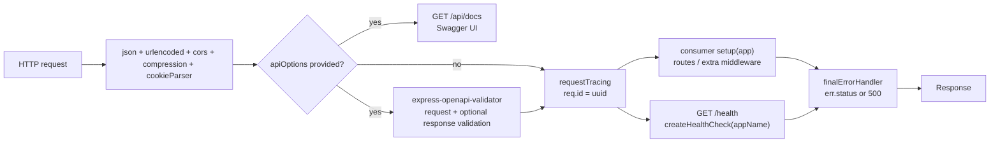

# @dhruv-m-patel/express-app

> Opinionated Express scaffolding for REST services — health checks, request tracing, error handling, optional OpenAPI 3 validation, and clustered start, all wired up for you.


## What it is

`@dhruv-m-patel/express-app` is a small, focused wrapper around Express that returns a fully configured `express.Application` with sensible defaults, so you can stop re-writing the same boilerplate in every service. Out of the box you get:

- `express.json()` and `express.urlencoded({ extended: true })` body parsing
- `cors`, `compression`, and `cookie-parser` middleware
- A per-request UUID set by the `requestTracing` middleware
- A `GET /health` endpoint
- A trailing JSON error handler that respects `err.status`
- Optional OpenAPI 3 request/response validation via `express-openapi-validator`
- Optional Swagger UI mounted at `/api/docs`
- Optional clustered start that forks one worker per CPU

## Highlights

- Single, declarative `configureApp(options)` call returns a ready-to-use Express app.
- `runApp(app, options)` handles `app.listen` plus optional `node:cluster` fan-out.
- Drop-in OpenAPI 3 validation by passing `apiOptions.apiSpec` and `specType: 'openapi'`.
- Async `setup` hook — return a `Promise` and the final error handler is attached after it resolves.
- Public middleware exports (`requestTracing`, `createHealthCheck`, `finalErrorHandler`) so you can compose your own pipeline if you outgrow `configureApp`.
- Dual ESM + CJS build with conditional `exports`; works in both module systems.
- TypeScript-first: full `.d.ts` files and exported `AppConfigOptions`, `ApiStartupOptions`, `ApiRequest`, `ApiError` types.

## Request flow




## Install

```bash
yarn add @dhruv-m-patel/express-app express
# or npm install @dhruv-m-patel/express-app express
```

`express` is a peer dependency (`>=4`).

## Quick start (TypeScript, ESM)

```ts
import { configureApp, runApp } from '@dhruv-m-patel/express-app';

const app = configureApp({
  appName: 'my-service',
  setup(app) {
    app.get('/api/hello', (_req, res) => res.json({ message: 'hello' }));
  },
});

runApp(app, { port: 4000 });
```

That is a complete service: `GET /health` returns `my-service is healthy`, `GET /api/hello` returns your JSON, every request has a UUID on `req.id`, and any thrown error is serialized to JSON by the final error handler.

## CommonJS consumer

```js
const { configureApp, runApp } = require('@dhruv-m-patel/express-app');

const app = configureApp({
  appName: 'my-service',
  setup(app) {
    app.get('/api/hello', (_req, res) => res.json({ message: 'hello' }));
  },
});

runApp(app, { port: 4000 });
```

The package ships a CJS build under `build/cjs/` resolved automatically through the `exports` map.

## OpenAPI validation

Pass an `apiOptions` block to enable request/response validation and the Swagger UI viewer:

```ts
import path from 'node:path';
import { configureApp, runApp } from '@dhruv-m-patel/express-app';

const app = configureApp({
  appName: 'orders-service',
  apiOptions: {
    apiSpec: path.resolve(import.meta.dirname, 'api/openapi.yaml'),
    specType: 'openapi',
    validateResponses: true,
  },
  setup(app) {
    app.get('/api/orders', (_req, res) => res.json([{ id: 1 }]));
  },
});

runApp(app, { port: 4000 });
```

Once running:

- Swagger UI is served at `http://localhost:4000/api/docs`.
- Incoming requests are validated against the spec before reaching your handlers.
- When `validateResponses: true` (default), responses are validated too; mismatches surface through the final error handler.

Validation errors are thrown with a `status` property (e.g. `400`), which `finalErrorHandler` reads to set the HTTP status.

## Async setup hook

`setup` may return a `Promise<void>`. When it does, `configureApp` defers attaching `finalErrorHandler` until after the promise resolves, so any middleware you mount asynchronously (db pools, dynamic route loading, etc.) is wired in before the error handler:

```ts
const app = configureApp({
  appName: 'my-service',
  async setup(app) {
    const router = await loadRoutes();
    app.use('/api', router);
  },
});

runApp(app, { port: 4000 });
```

## Clustered start

Set `useClusteredStart: true` to fork one worker per CPU core. The primary process forks workers and each worker calls `app.listen`:

```ts
import { configureApp, runApp } from '@dhruv-m-patel/express-app';

const app = configureApp({ appName: 'my-service' });

runApp(app, {
  port: 4000,
  useClusteredStart: true,
  callback: () => console.log('worker ready'),
});
```

Console output (4-core machine):

```
Main server process id: 51234
Forking 4 child server processes on CPU Model Apple M2
Server child process id 51235 running, listening on port 4000
Server child process id 51236 running, listening on port 4000
...
```

## Public API

```ts
import {
  configureApp,
  runApp,
  requestTracing,
  createHealthCheck,
  finalErrorHandler,
  // types
  AppConfigOptions,
  ApiStartupOptions,
  ApiRequest,
  ApiError,
  ApiSpecType,
} from '@dhruv-m-patel/express-app';
```

### `configureApp(options?: AppConfigOptions): express.Application`

Builds and returns a configured app. All options are optional.

### `runApp(app, options?: ApiStartupOptions): void`

Listens on `options.port` (default `5000`). With `useClusteredStart: true` the primary forks workers; each worker calls `listen`.

### Middleware (manual mounting)

You can skip `configureApp` and mount the building blocks yourself:

```ts
import express from 'express';
import {
  requestTracing,
  createHealthCheck,
  finalErrorHandler,
} from '@dhruv-m-patel/express-app';

const app = express();
app.use(express.json());
app.use(requestTracing);
app.get('/health', createHealthCheck('my-service'));
app.get('/api/things', (_req, res) => res.json([]));
app.use(finalErrorHandler); // must be last
```

- `requestTracing(req, res, next)` — assigns `req.id = uuid()` if not already set.
- `createHealthCheck(appName: string)` — returns an Express handler that responds `200 "<appName> is healthy"`.
- `finalErrorHandler(err, req, res, next)` — JSON error responder; uses `err.status ?? 500` and `err.message`.

## `AppConfigOptions`

| Field        | Type                                                                    | Default     | Description                                                                                                       |
| ------------ | ----------------------------------------------------------------------- | ----------- | ----------------------------------------------------------------------------------------------------------------- |
| `appName`    | `string`                                                                | `'Service'` | Used by the `/health` endpoint response.                                                                          |
| `apiOptions` | `{ apiSpec: string; specType: 'openapi'; validateResponses?: boolean }` | `undefined` | When provided, mounts Swagger UI at `/api/docs` and (for `specType: 'openapi'`) attaches the OpenAPI validator.   |
| `setup`      | `(app: Application) => void \| Promise<void>`                           | `undefined` | Hook to mount your routes. If it returns a `Promise`, the final error handler is appended after it resolves.      |

> Note: the `ApiSpecType` union still includes `'swagger'` for source-level compatibility, but only `'openapi'` activates a validator. Swagger 2 specs are no longer validated — see *Migrating from v1*.

## `ApiStartupOptions`

| Field               | Type                          | Default         | Description                                                                            |
| ------------------- | ----------------------------- | --------------- | -------------------------------------------------------------------------------------- |
| `appName`           | `string`                      | `'express-app'` | Used in the listen log message (single-process mode only).                             |
| `port`              | `number`                      | `5000`          | Port to bind.                                                                          |
| `useClusteredStart` | `boolean`                     | `false`         | When `true`, the primary process forks one worker per CPU; each worker calls `listen`. |
| `setup`             | `() => void \| Promise<void>` | `undefined`     | Awaited (if it returns a `Promise`) before the server starts listening.                |
| `callback`          | `() => void`                  | `undefined`     | Invoked once `app.listen`'s callback fires.                                            |

## Build output

The package ships dual builds with conditional `exports`:

```
build/
  cjs/index.js     build/cjs/index.d.ts
  esm/index.js     build/esm/index.d.ts
```

`package.json` resolves `import` to ESM and `require` to CJS automatically; consumers do not need to think about it.

## Requirements

- Node `>=22`
- Express `>=4` (peer dependency)

## Migrating from v1

v2 contains breaking changes:

- **Swagger 2 validation dropped.** Only OpenAPI 3 (`specType: 'openapi'`) is validated; the `swagger-express-validator` dependency is gone. Migrate your spec to OpenAPI 3.
- **`useBabel` removed.** The `@babel/register` runtime hook from v1 is no longer wired. Compile your code ahead of time (TypeScript / SWC / esbuild).
- **Tests run on Vitest**, not Jest. Consumer test code is unaffected; only relevant if you fork or contribute to this package.
- Node `>=22` required.

## Scripts

| Script            | Description                                             |
| ----------------- | ------------------------------------------------------- |
| `yarn build`      | Clean and dual-build (CJS + ESM).                       |
| `yarn build:cjs`  | Build the CommonJS bundle (`tsc -p tsconfig.cjs.json`). |
| `yarn build:esm`  | Build the ESM bundle (`tsc -p tsconfig.esm.json`).      |
| `yarn lint`       | Run ESLint over the package.                            |
| `yarn test`       | Run Vitest once.                                        |
| `yarn test:watch` | Run Vitest in watch mode.                               |
| `yarn test:ci`    | Run Vitest with coverage and verbose reporters.         |
| `yarn typecheck`  | `tsc --noEmit`.                                         |

## License

MIT
