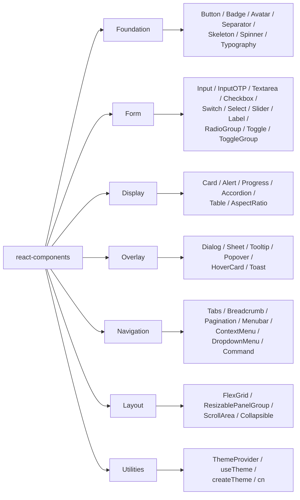

# @dhruv-m-patel/react-components

A production-grade, themeable React component library built on Radix UI primitives, Tailwind CSS v4, and shadcn/ui patterns.


## What it is

`@dhruv-m-patel/react-components` ships ~41 accessible, headless-by-default React components — buttons, dialogs, menus, forms, navigation, layout primitives — wired to a token-driven OKLCH theme. Components compose Radix UI primitives, are styled with Tailwind v4 utility classes, and follow shadcn/ui copy-this-into-your-app conventions while remaining a normal published npm package. ESM-only, fully typed, tree-shakeable.

## Tech stack

- React 18 / 19 (peer)
- Tailwind CSS v4 (no PostCSS config required when using `@tailwindcss/vite`)
- Radix UI primitives (Dialog, Popover, Select, Tabs, etc.)
- `class-variance-authority` (CVA) + `tailwind-merge` + `clsx`
- Storybook 8 for component docs and visual tests
- Vitest + Testing Library for unit/integration tests
- TypeScript 5.7

## Install

```bash
yarn add @dhruv-m-patel/react-components react react-dom
yarn add -D tailwindcss @tailwindcss/vite
```

## Tailwind v4 setup

Consumers must wire Tailwind v4 into their bundler and import the package's compiled theme CSS once at the app root.

```ts
// src/main.tsx
import '@dhruv-m-patel/react-components/styles';
```

A minimal Vite config:

```ts
// vite.config.ts
import { defineConfig } from 'vite';
import react from '@vitejs/plugin-react';
import tailwindcss from '@tailwindcss/vite';

export default defineConfig({
  plugins: [react(), tailwindcss()],
});
```

If you use PostCSS instead of the Vite plugin, install `@tailwindcss/postcss` and add it to your PostCSS config — Tailwind v4 no longer needs a `tailwind.config.js`.

## Quick start

```tsx
import {
  Button,
  Card,
  CardContent,
  CardHeader,
  CardTitle,
  Dialog,
  DialogContent,
  DialogTitle,
  DialogTrigger,
} from '@dhruv-m-patel/react-components';

export function Greeting() {
  return (
    <Card>
      <CardHeader>
        <CardTitle>Hello</CardTitle>
      </CardHeader>
      <CardContent>
        <Dialog>
          <DialogTrigger asChild>
            <Button variant="default">Open</Button>
          </DialogTrigger>
          <DialogContent>
            <DialogTitle>Hello world</DialogTitle>
            <p>This is a Radix-powered modal.</p>
          </DialogContent>
        </Dialog>
      </CardContent>
    </Card>
  );
}
```

## Theming

Wrap your app in `ThemeProvider` and read state with `useTheme`. The provider persists user preference to `localStorage`, follows the system color scheme by default, and toggles a `.light` / `.dark` class on `<html>`.

```tsx
import {
  ThemeProvider,
  useTheme,
  Button,
} from '@dhruv-m-patel/react-components';

function ThemeToggle() {
  const { resolvedTheme, toggleTheme } = useTheme();
  return (
    <Button variant="outline" onClick={toggleTheme}>
      Switch to {resolvedTheme === 'light' ? 'dark' : 'light'} mode
    </Button>
  );
}

export function App() {
  return (
    <ThemeProvider defaultTheme="system">
      <ThemeToggle />
    </ThemeProvider>
  );
}
```

`ThemeProvider` accepts:

- `defaultTheme`: `'light' | 'dark' | 'system'` (default `'system'`)
- `overrides`: a partial `ColorPalette` of OKLCH values applied as inline CSS variables
- `storageKey`: `localStorage` key (default `'ui-theme'`)

The full OKLCH palette and CSS variable contract live in `src/styles/theme.css`. Override individual tokens with `overrides`, or extend the stylesheet in your own app.

## Component catalog

All exports verified against `src/index.ts`. Grouped by use case.



### Foundation

`Button`, `Badge`, `Avatar` (with `AvatarImage`, `AvatarFallback`), `Separator`, `Skeleton`, `Spinner`, Typography (`H1`, `H2`, `H3`, `H4`, `P`, `Lead`, `Large`, `Small`, `Muted`, `InlineCode`, `Blockquote`)

### Form

`Input`, `InputOTP` (+ `InputOTPGroup`, `InputOTPSlot`, `InputOTPSeparator`), `Textarea`, `Checkbox`, `Switch`, `Select` (+ `SelectGroup`, `SelectValue`, `SelectTrigger`, `SelectContent`, `SelectLabel`, `SelectItem`, `SelectSeparator`), `Slider`, `Label`, `RadioGroup` (+ `RadioGroupItem`), `Toggle`, `ToggleGroup` (+ `ToggleGroupItem`)

### Display

`Card` (+ `CardHeader`, `CardFooter`, `CardTitle`, `CardDescription`, `CardContent`), `Alert` (+ `AlertTitle`, `AlertDescription`), `Progress`, `Accordion` (+ `AccordionItem`, `AccordionTrigger`, `AccordionContent`), `Table` (+ `TableHeader`, `TableBody`, `TableFooter`, `TableHead`, `TableRow`, `TableCell`, `TableCaption`), `AspectRatio`

### Overlay

`Dialog` (+ portal/overlay/trigger/close/content/header/footer/title/description), `Sheet` (same set), `Tooltip` (+ `TooltipProvider`, `TooltipTrigger`, `TooltipContent`), `Popover` (+ `PopoverTrigger`, `PopoverContent`, `PopoverAnchor`), `HoverCard` (+ `HoverCardTrigger`, `HoverCardContent`), `Toast` (+ `ToastProvider`, `Toaster`, `useToast`, plus title/description/close/action subcomponents)

### Navigation

`Tabs` (+ `TabsList`, `TabsTrigger`, `TabsContent`), `Breadcrumb` (+ list/item/link/page/separator/ellipsis), `Pagination` (+ content/item/link/previous/next/ellipsis), `Menubar` (full menu set), `ContextMenu` (full menu set), `DropdownMenu` (full menu set), `Command` (+ `CommandDialog`, `CommandInput`, `CommandList`, `CommandEmpty`, `CommandGroup`, `CommandItem`, `CommandShortcut`, `CommandSeparator`)

### Layout

`FlexGrid`, `ResizablePanelGroup` (+ `ResizablePanel`, `ResizableHandle`), `ScrollArea` (+ `ScrollBar`), `Collapsible` (+ `CollapsibleTrigger`, `CollapsibleContent`)

### Utilities

`cn` (Tailwind class merger), `ThemeProvider`, `useTheme`, `createTheme`

## Storybook

```bash
yarn workspace @dhruv-m-patel/react-components storybook
```

Storybook runs on port `6007`. Bundled long-form docs live under `docs/` and are mounted as MDX stories:

- `docs/getting-started.mdx`
- `docs/component-catalog.mdx`
- `docs/theming.mdx`
- `docs/component-patterns.mdx`
- `docs/testing.mdx`
- `docs/adoption-guide.mdx`

## Build output

- `dist/index.js` — ESM bundle
- `dist/index.d.ts` — type declarations
- `dist/styles/theme.css` — compiled theme stylesheet (imported via `@dhruv-m-patel/react-components/styles`)

ESM-only. `package.json` declares `"type": "module"` and `sideEffects: ["**/*.css"]` for safe tree-shaking.

## Requirements

- React `^18.0.0 || ^19.0.0`
- A Tailwind v4-aware bundler (Vite + `@tailwindcss/vite`, or PostCSS + `@tailwindcss/postcss`)
- Node 22+ for development of this package

## Migrating from v1 (Material-UI)

v2 is a hard rewrite — there is **no compatibility shim** with the v1 Material-UI API. Component names overlap in places but props, theming, and styling semantics are different. Plan a deliberate migration:

- Map v1 components to v2 by **use case**, not by name. The 41 Radix-based replacements cover the same surface, but the API is closer to shadcn/ui.
- Theming moved from MUI's `ThemeProvider` (JSS/`createTheme` palette object) to a CSS-variable-driven OKLCH palette controlled via `ThemeProvider` + `overrides`.
- Styling moved from `makeStyles` / `withStyles` to Tailwind utility classes plus the `cn()` helper.
- All overlays (Dialog, Popover, Tooltip, Menu) now sit on Radix primitives — accessibility behavior and DOM structure differ from MUI.

For per-package version history see [`CHANGELOG.md`](./CHANGELOG.md). For monorepo-wide release flow see [`PUBLISHING.md`](../../PUBLISHING.md) at the repo root.

## Scripts

| Script             | What it does                                                  |
| ------------------ | ------------------------------------------------------------- |
| `build`            | Vite build + `tsc` declarations + copy `theme.css` to `dist`  |
| `dev`              | Vite build in watch mode                                      |
| `lint`             | ESLint over the package                                       |
| `test`             | Run Vitest once                                               |
| `test:watch`       | Vitest in watch mode                                          |
| `test:ci`          | Vitest with coverage and verbose reporters                    |
| `typecheck`        | `tsc --noEmit`                                                |
| `storybook`        | Start Storybook dev server on port 6007                       |
| `build-storybook`  | Build the static Storybook site                               |
| `clean`            | Remove `dist/` and `storybook-static/`                        |

## License

MIT
