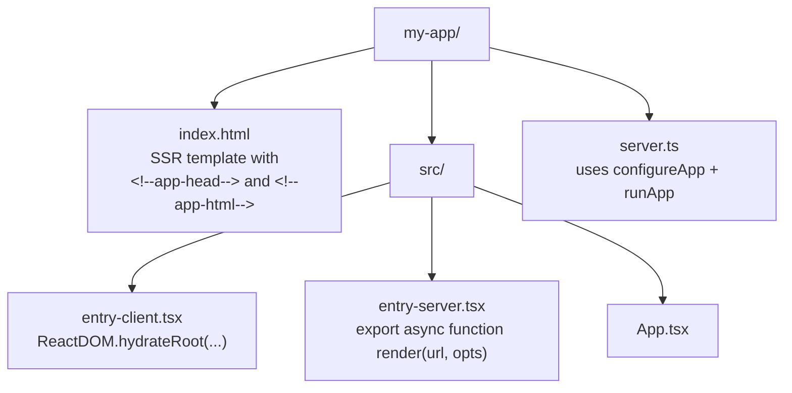

# @dhruv-m-patel/web-app

> Express SSR scaffolding for Vite-powered React apps — drop-in replacement for the legacy Webpack 4 implementation.


## What it is

`@dhruv-m-patel/web-app` wires up an Express server that server-side renders a React app through [Vite](https://vitejs.dev/). In **development** Vite runs in middleware mode for HMR-friendly SSR; in **production** the pre-built client and server bundles are served from disk. The same `configureApp` / `runApp` pair works in both modes.

## Highlights

- SSR via Vite middleware mode in development, prebuilt server bundle in production.
- Standard middleware stack: `compression`, `cookie-parser`, `cors`, `morgan`, JSON + URL-encoded body parsing.
- Per-request UUID via the `requestTracing` middleware.
- `GET /health` mounted automatically.
- Optional `express-session` enabled by passing `sessionSecret`.
- Async `setup` hook for mounting API routes / middleware before the SSR catch-all.
- `runApp` awaits async wiring (`app.locals.ready`) before binding the socket.
- Optional clustered start (one worker per CPU, with auto-respawn on exit).
- Public middleware re-exports (`createHealthCheck`, `requestTracing`, `finalErrorHandler`).
- Dual ESM + CJS build with conditional `exports`.
- TypeScript-first: full `.d.ts` and exported `WebAppOptions`, `RunOptions`, `ViteConfigOptions`, `ExtendedRequest` types.

## Install

```bash
yarn add @dhruv-m-patel/web-app express vite @vitejs/plugin-react
```

You will also need `react` and `react-dom` for your own app code. Peer dependencies: `express >=4`, `vite ^6`, `@vitejs/plugin-react ^4`.

## Project layout

A typical consumer project looks like this:



Add a request-flow view to keep the dev / prod paths straight:

```mermaid
flowchart LR
    Req[HTTP request] --> Mw[Express middleware<br/>cors / compression / cookieParser /<br/>morgan / requestTracing / session?]
    Mw --> Health{path == /health?}
    Health -- yes --> H[createHealthCheck handler]
    Health -- no --> Mode{NODE_ENV}
    Mode -- development --> Dev[vite.middlewares -> SSR catch-all<br/>vite.transformIndexHtml + vite.ssrLoadModule]
    Mode -- production --> Prod[express.static dist/client + SSR catch-all<br/>imports dist/server/entry-server.js]
    Dev --> Render[render -> { html, head? }]
    Prod --> Render
    Render --> Resp[200 text/html]
    Mw -. error .-> Err[finalErrorHandler]
```

### `index.html` template

```html
<!doctype html>
<html lang="en">
  <head>
    <meta charset="UTF-8" />
    <meta name="viewport" content="width=device-width, initial-scale=1.0" />
    <!--app-head-->
  </head>
  <body>
    <div id="root"><!--app-html--></div>
    <script type="module" src="/src/entry-client.tsx"></script>
  </body>
</html>
```

The placeholders `<!--app-head-->` and `<!--app-html-->` are replaced on every SSR request with the values returned by your `render` function.

### `src/entry-server.tsx`

```tsx
import { renderToString } from 'react-dom/server';
import App from './App.js';

export async function render(
  url: string,
): Promise<{ html: string; head?: string }> {
  const html = renderToString(<App url={url} />);
  return { html, head: '<title>My App</title>' };
}
```

### `src/entry-client.tsx`

```tsx
import { hydrateRoot } from 'react-dom/client';
import App from './App.js';

hydrateRoot(
  document.getElementById('root') as HTMLElement,
  <App url={window.location.pathname} />,
);
```

### `server.ts`

```ts
import { configureApp, runApp } from '@dhruv-m-patel/web-app';

const app = configureApp({
  appName: 'my-web-app',
  mode: process.env.NODE_ENV === 'production' ? 'production' : 'development',
  serverEntry: 'src/entry-server.tsx',
  templateHtml: 'index.html',
  setup(app) {
    app.get('/api/health-extra', (_req, res) => res.json({ extra: true }));
  },
});

runApp(app, { port: 3000 });
```

## Build pipeline

`getViteConfig` returns the baseline Vite `InlineConfig` for the **client** half of an SSR build. Wire it into a `vite.config.ts`:

```ts
// vite.config.ts
import { defineConfig } from 'vite';
import { getViteConfig } from '@dhruv-m-patel/web-app';

export default defineConfig(getViteConfig());
```

Then build both halves and start the server:

```bash
vite build --ssrManifest --outDir dist/client
vite build --ssr src/entry-server.tsx --outDir dist/server
node server.js
```

In production `configureApp` expects:

- Client assets at `<clientRoot>/dist/client` (served via `express.static`).
- Compiled SSR bundle at `<clientRoot>/dist/server/entry-server.js` (loaded via dynamic `import()`).
- `index.html` at `<clientRoot>/dist/client/index.html`.

## Public API

```ts
import {
  configureApp, // also the default export
  runApp,
  getViteConfig,
  createHealthCheck,
  requestTracing,
  finalErrorHandler,
  // types
  WebAppOptions,
  RunOptions,
  ViteConfigOptions,
  ExtendedRequest,
} from '@dhruv-m-patel/web-app';
```

### `configureApp(options?: WebAppOptions): express.Application`

Returns synchronously, but performs async wiring (Vite createServer, consumer `setup`, the SSR catch-all, the final error handler) on a promise stored at `app.locals.ready`. If you don't use `runApp`, you must `await app.locals.ready` before calling `app.listen`.

### `runApp(app, options?: RunOptions): void`

Awaits `app.locals.ready` and then calls `app.listen`. With `useClusteredStart: true`, the primary process forks one worker per CPU and respawns workers on exit; each worker performs the listen.

### `getViteConfig(options?: ViteConfigOptions): InlineConfig`

Baseline client SSR config: applies `@vitejs/plugin-react`, sets `appType: 'custom'`, emits `dist/client` with `manifest: true` and `ssrManifest: true`.

### Re-exported middleware

Same trio as `@dhruv-m-patel/express-app`:

- `requestTracing(req, res, next)` — assigns `req.id = uuid()` if not already set.
- `createHealthCheck(appName: string)` — handler that responds `200 "<appName> is healthy"`.
- `finalErrorHandler(err, req, res, next)` — JSON error responder; uses `err.status ?? 500`.

## `WebAppOptions`

| Field               | Type                                          | Default                     | Description                                                                                                                                              |
| ------------------- | --------------------------------------------- | --------------------------- | -------------------------------------------------------------------------------------------------------------------------------------------------------- |
| `appName`           | `string`                                      | `'web-app'`                 | Display name, surfaced through `/health`.                                                                                                                |
| `mode`              | `'development' \| 'production'`               | `process.env.NODE_ENV` or `'production'` | Drives whether Vite middleware mode SSR is wired up (development) or the pre-built bundle is served (production).                                  |
| `clientRoot`        | `string`                                      | `process.cwd()`             | Project root used as the Vite root and as the base for resolving `serverEntry`, `templateHtml`, and built bundle paths.                                  |
| `serverEntry`       | `string`                                      | `'src/entry-server.tsx'`    | Path to the SSR entry source file, resolved from `clientRoot`.                                                                                           |
| `templateHtml`      | `string`                                      | `'index.html'`              | Path to the HTML template used by the SSR catch-all route, resolved from `clientRoot`.                                                                   |
| `staticDirectories` | `string[]`                                    | `[]`                        | Additional directories exposed via `express.static` in production. Each entry is resolved against `clientRoot`.                                          |
| `sessionSecret`     | `string`                                      | `undefined`                 | If provided, enables `express-session` with this secret (httpOnly cookie, 1-hour `maxAge`).                                                              |
| `setup`             | `(app: Application) => void \| Promise<void>` | `undefined`                 | Hook to mount API routes / middleware on the Express app before the SSR catch-all is installed. Awaited if it returns a `Promise`.                       |
| `viteConfig`        | `InlineConfig`                                | `undefined`                 | Vite config override merged into the base SSR config via `mergeConfig` from `'vite'`.                                                                    |

## `RunOptions`

| Field               | Type                          | Default     | Description                                                                                       |
| ------------------- | ----------------------------- | ----------- | ------------------------------------------------------------------------------------------------- |
| `port`              | `number`                      | `3000`      | Port to listen on.                                                                                |
| `appName`           | `string`                      | `'web-app'` | Used in the listen log message.                                                                   |
| `useClusteredStart` | `boolean`                     | `false`     | When `true` and on the primary process, forks one worker per CPU and auto-respawns on exit.       |
| `setup`             | `() => void \| Promise<void>` | `undefined` | Invoked before `app.listen`. Awaited if it returns a `Promise`.                                   |
| `callback`          | `() => void`                  | `undefined` | Invoked once the server is listening.                                                             |

## `ViteConfigOptions`

| Field         | Type     | Default                    | Description                                              |
| ------------- | -------- | -------------------------- | -------------------------------------------------------- |
| `clientRoot`  | `string` | `process.cwd()`            | Project root, passed through to Vite as `root`.          |
| `serverEntry` | `string` | `'src/entry-server.tsx'`   | SSR entry path relative to `clientRoot`.                 |
| `clientEntry` | `string` | `'src/entry-client.tsx'`   | Client entry path relative to `clientRoot`.              |
| `outDir`      | `string` | `'dist'`                   | Output directory relative to `clientRoot`. Client assets land in `<outDir>/client`. |

## Sessions

Pass `sessionSecret` to opt into `express-session`:

```ts
const app = configureApp({
  appName: 'my-web-app',
  sessionSecret: process.env.SESSION_SECRET,
});
```

Default cookie settings: `httpOnly: true`, `maxAge: 3_600_000` (1 hour), `resave: false`, `saveUninitialized: true`. If you need different settings, mount your own `session(...)` inside `setup` instead.

## Health check

`GET /health` is mounted automatically and responds with `<appName> is healthy`. No configuration required.

## Static directories

Use `staticDirectories` to expose extra asset directories through `express.static` (in addition to `dist/client`, which is always served in production):

```ts
configureApp({
  staticDirectories: ['public', '../shared-assets'],
});
```

Each entry is resolved against `clientRoot`.

## Requirements

- Node `>=22`
- Express `>=4` (peer dependency)
- Vite `^6` (peer dependency)
- `@vitejs/plugin-react` `^4` (peer dependency)

## Migrating from v1 (Webpack)

v2 swaps the entire build engine from Webpack 4 to Vite. Summary:

- **`getWebpackConfig` removed** — replaced by `getViteConfig`.
- **`paths.routes` directory routing dropped** — `express-enrouten`-style file-based routing is gone. Mount routes explicitly inside `setup(app)`.
- **`useBabel` removed** — no more `@babel/register` runtime hook. Compile ahead of time.
- **`fetch-everywhere` polyfill removed** — Node 22 ships `fetch` natively.
- **Module shape changed** — `WebAppOptions` no longer accepts `paths.routes`; new fields are `serverEntry`, `templateHtml`, `clientRoot`, `staticDirectories`, `viteConfig`.
- Node `>=22` required.

## Scripts

| Script            | Description                                                  |
| ----------------- | ------------------------------------------------------------ |
| `yarn build`      | Clean, dual-build (CJS + ESM), and write per-folder `package.json` markers. |
| `yarn build:cjs`  | Build the CommonJS bundle (`tsc -p tsconfig.cjs.json`).      |
| `yarn build:esm`  | Build the ESM bundle (`tsc -p tsconfig.esm.json`).           |
| `yarn lint`       | Run ESLint over the package.                                 |
| `yarn test`       | Run Vitest once.                                             |
| `yarn test:watch` | Run Vitest in watch mode.                                    |
| `yarn test:ci`    | Run Vitest with coverage and verbose reporters.              |
| `yarn typecheck`  | `tsc --noEmit`.                                              |

## License

MIT
